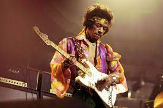

# owengropper
<!DOCTYPE html>
<html>
    <head>
        <meta charset="utf-8">
        <title>About me</title>
    </head>
    <body>

<table>
	<thead>
		<tr></tr>
		<tr></tr>
		<tr></tr>
	</thead>
	<h2>About me</h2>
      
My name is Owen Gropper and I am a new student a URI. I grew up in Rhode Island, so it is a state I am very familiar with and I'd say it's pretty nice. Other than one coding class over the summer a couple years ago I am fairly new to coding. I like to play the guitar a lot and have been doing that for a few years. I also just like listening to all types of music. Moreover, I have studied Japanese for a while and intend to hopefully minor in it considering how much work I put into it I want to keep getting better at it.

      <thead>
		<tr></tr>
		<tr></tr>
    </body>
</html>

